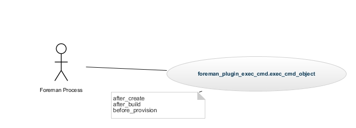
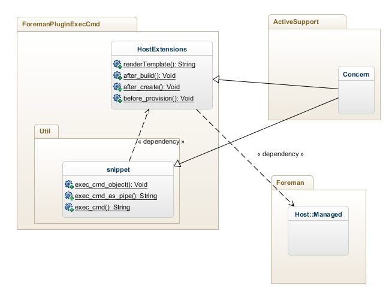

# foreman_plugin_cmd_exec
Foreman plugin that just executes a given command.

# Installation:

Just download the gem file or build it from source:

```gem build foreman_plugin_exec_cmd.gemspec```

Then install the plugin by adding it to foreman

```gem install foreman_plugin_exec_cmd```

and add it to the bundle environment:
```echo 'gem "foreman_plugin_exec_cmd"' > bundle.d/foreman_plugin_exec_cmd.rb```

Then bundle update.

```bundle update```

# Usage

Now enable the plugin in the foreman settings.yaml file and specify a command to be called e.g.:
```
cat >>config/settings.yaml << EOF 
:pluginExecCmd:
  :enabled: true
  :cmd: 'cat &gt; /tmp/#{self.name}.out'
  :aspipe: '{:host => self, :host_params => self.host_params, :partitioninclude => self.diskLayout, :networkinclude => self.renderTemplate, :owner => self.owner, :interfaces => self.interfaces}.to_json'
EOF
```

The aspipe parameter specifies a valid ruby command that will pipe the standard output to the command specified as cmd.

The self attribute referres to the Host::Managed class of the host being passed to the callback.

In this example the given parameters of the host are used to construct as hash that is afterwards converted to the JSON format. This could then be used by any other command understanding the JSON input.
In this case the JSON is just written to the file /tmp/#{self.name}.out.

# Source Code

## UML Documentation

### Use Case

This image describes the current use case how foreman calls this plugin.
Also see: [Foreman Template Writing](http://projects.theforeman.org/projects/1/wiki/TemplateWriting)


### Class Diagram



Basically the plugin consists of one class that corresponds to two files:

app/models/foreman\_plugin\_exec\_cmd/host\_extension.rb and lib/foreman\_plugin\_exec_cmd/util.rb.

In host_extension.rb the callbacks are defined that are being called for the following events:

* after_create
* after_build
* before_provision

These themselves call the class method exec_cmd_object.

#### ForemanPluginExecCmd::Util

This file defines the methods for executing external commands.
First the plugin is checked for being enabled.

The method exec\_cmd\_object method.

# Copyright

[Update copyright accordingly.  GPLv3 is used as Foreman itself is.]

Copyright (c) 2012-2013 Red Hat Inc.

This program is free software: you can redistribute it and/or modify
it under the terms of the GNU General Public License as published by
the Free Software Foundation, either version 3 of the License, or
(at your option) any later version.

This program is distributed in the hope that it will be useful,
but WITHOUT ANY WARRANTY; without even the implied warranty of
MERCHANTABILITY or FITNESS FOR A PARTICULAR PURPOSE.  See the
GNU General Public License for more details.

You should have received a copy of the GNU General Public License
along with this program.  If not, see <http://www.gnu.org/licenses/>.
